# AWS CI/CD Pipeline - Deploy Spring Boot Application to ECS using CodeBuild & Code Pipeline
## Overview
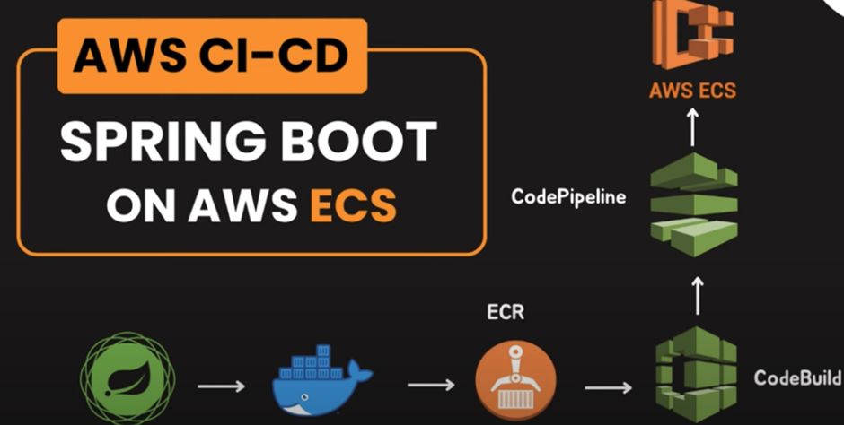

## Prerequisites
1. AWS Account
2. GitHub Account
3. Docker Hub Account
4. AWS CLI
5. AWS CDK
6. AWS CodeBuild
7. AWS CodePipeline
8. AWS ECR
9. AWS ECS
10. AWS IAM
11. A simple Spring Boot Application

## Steps
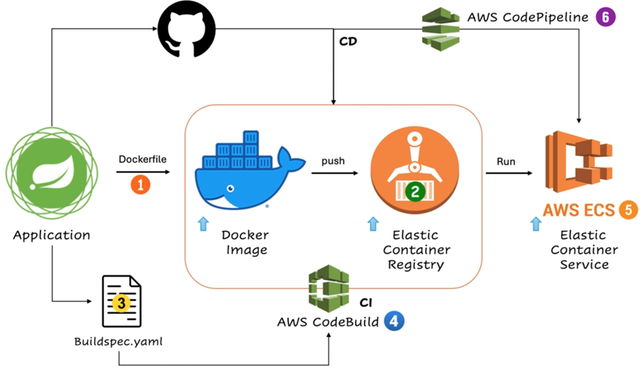
0. Create a simple Spring-boot project: course-service
https://github.com/garymar2007/course-service
1. Create a Dockerfile
```
FROM openjdk:17
WORKDIR /app
COPY ./target/course-service.jar /app
EXPOSE 8080
CMD ["java", "-jar", "course-service.jar"]
```
2. Create ECR in AWS
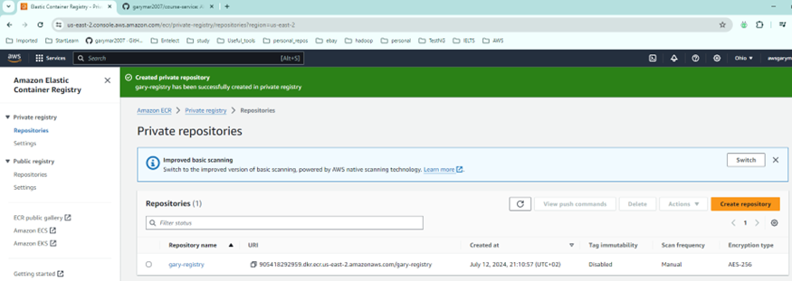
3. Create buildspec.yaml
```
version: 0.2

phases:
  pre_build:
    commands:
      - mvn clean install
      - echo Logging in to Amazon ECR...
      - aws --version
      - REPOSITORY_URI=905418292959.dkr.ecr.us-east-2.amazonaws.com/gary-registry
      - aws ecr get-login-password --region us-east-2 | docker login --username AWS --password-stdin $REPOSITORY_URI
      - COMMIT_HASH=$(echo $CODEBUILD_RESOLVED_SOURCE_VERSION | cut -c 1-7)
      - IMAGE_TAG=build-${echo $CODEBUILD_BUILD_ID | awk -F":" '{print $2}')
  build:
    commands:
      - echo Build started on `date`
      - echo Building the Docker image...
        - docker build -t $REPOSITORY_URI:latest .
        - docker tag $REPOSITORY_URI:latest $REPOSITORY_URI:$IMAGE_TAG
    post_build:
      commands:
        - echo Build completed on `date`
        - echo Pushing the Docker images...
        - docker push $REPOSITORY_URI:latest
        - docker push $REPOSITORY_URI:$IMAGE_TAG
        - echo Writing image definitions file...
        - printf '[{"name":"course-service","imageUri":"%s"}]' $REPOSITORY_URI:$IMAGE_TAG > imagedefinitions.json
        - echo Writing image definitions file...
        # add your container name
        - DOCKER_CONTAINER_NAME=gary-registry
        - printf '[{"name":"%s","imageUri":"%s"}]' $DOCKER_CONTAINER_NAME $REPOSITORY_URI:$IMAGE_TAG > imagedefinitions.json
        - echo $DOCKER_CONTAINER_NAME
        - echo printing imagedefinitions.json
        - cat imagedefinitions.json

    artifacts:
      files:
        - imagedefinitions.json
        - target/course-service.jar

```
4. Create AWS codeBuild
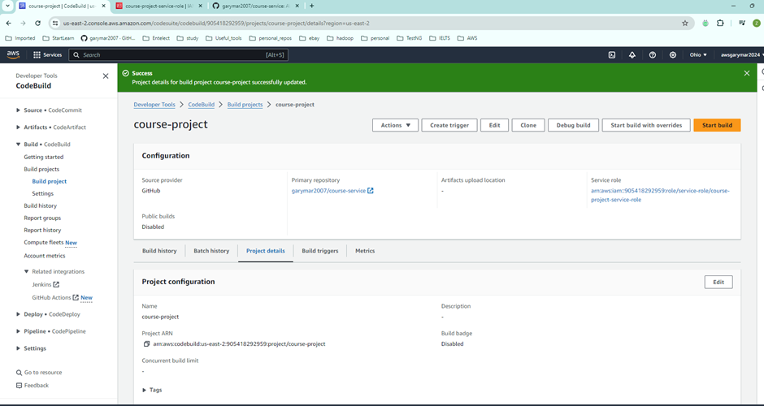
The service role needs to be configured correctly:
Go to the service roleadd permissionsattach policesadd the following two policies:
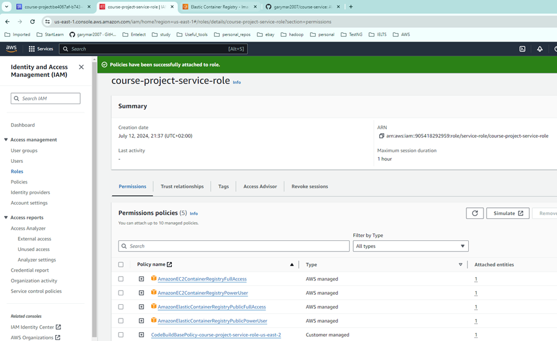
Start the build (Start build) in AWS CodeBuild
This will load the buildspec.yaml file from the repository and create docker image, and push the image to ECR.
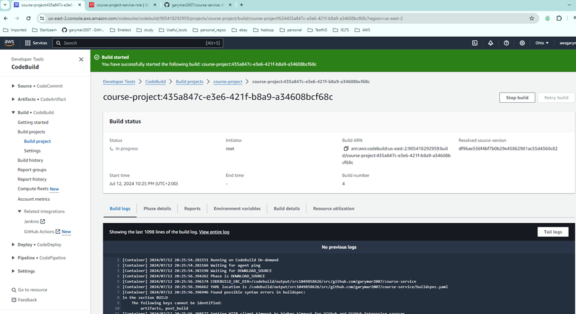
Check the image in ECR:
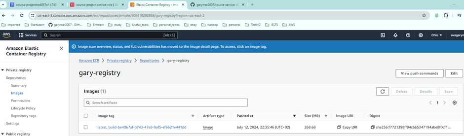
5. Create AWS ECS
a.	Create Task Definition:
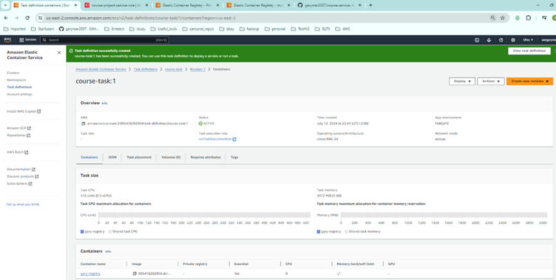
NB: The Image of the task definition is actually the Repository URI of the image: 905418292959.dkr.ecr.us-east-2.amazonaws.com/gary-registry.
b.	Create cluster
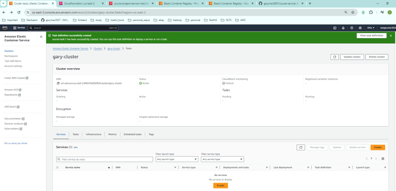
c.	Create a service to map task to cluster
NB: There was an error deploying course-service-v2
Resource handler returned message: "Error occurred during operation 'ECS Deployment Circuit Breaker was triggered'." (RequestToken: 22f27bd5-1bf6-0faa-d75c-a397fcf98728, HandlerErrorCode: GeneralServiceException)
soln: You may check CloudTrail to find out the reason.  Most of the time, the reason is failure to start application.
d.	Check the application is running
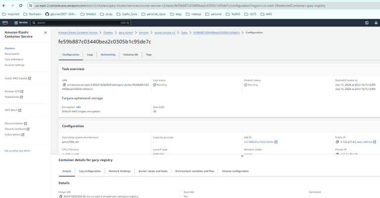
Open the public IP address and go to the swagger document, since we have dependency:
```
<dependency>
    <groupId>org.springdoc</groupId>
    <artifactId>springdoc-openapi-starter-webmvc-ui</artifactId>
    <version>2.0.4</version>
</dependency>
```
http://3.135.231.8:8080/swagger-ui/index.html
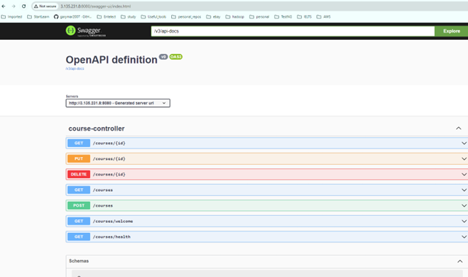
e.	Trigger codeBuild when commit happens to repository
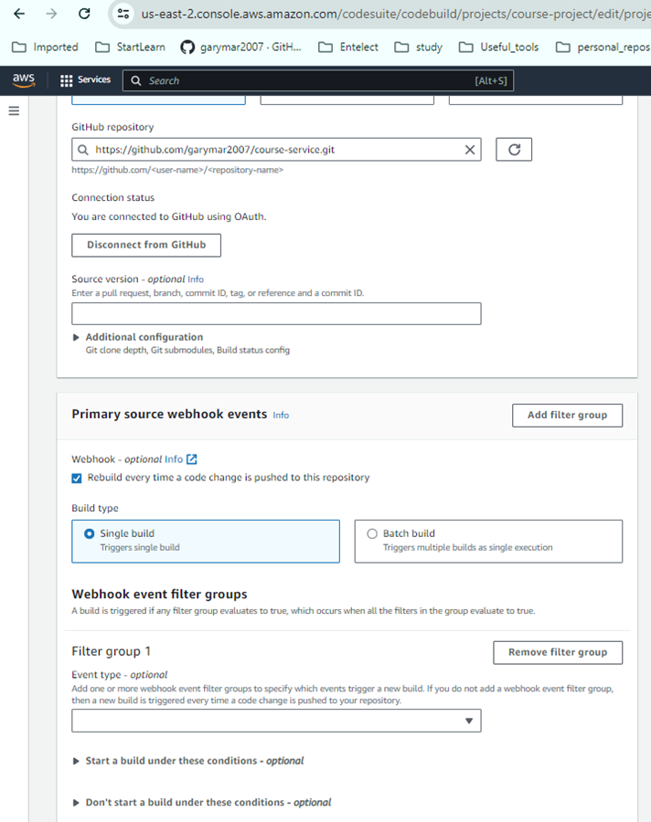
6.	AWS CodePipeline
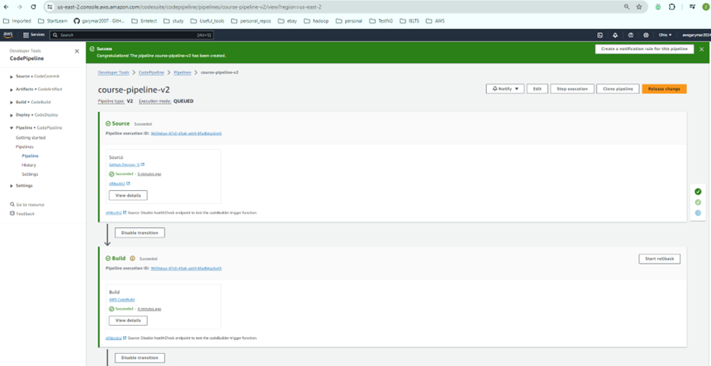

## Test the entire process
•	Initial status – no healthCheck endpoint:
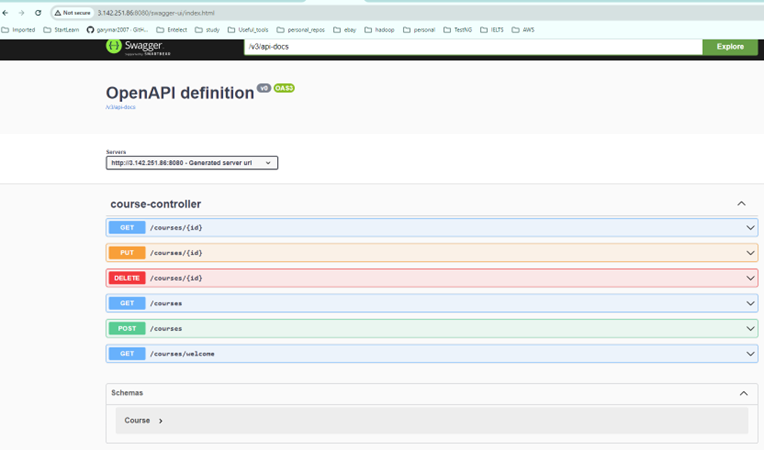
•	To enable the healthCheck endpoint in the code base;
•	Commit the changes;
•	codeBuild will be triggered;
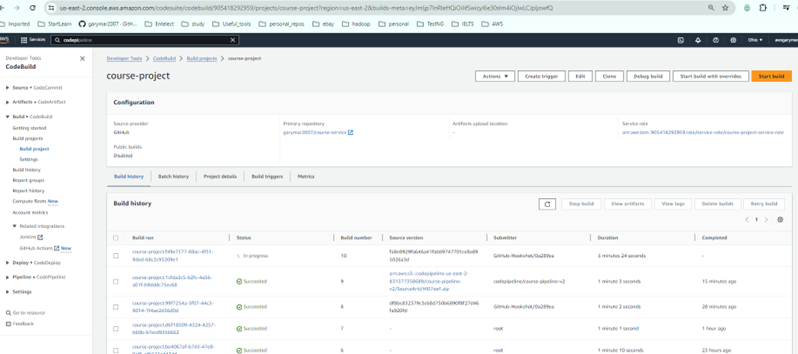
•	Once codeBuild is done, the codePipeline should be triggered to deploy the changes onto ECS.
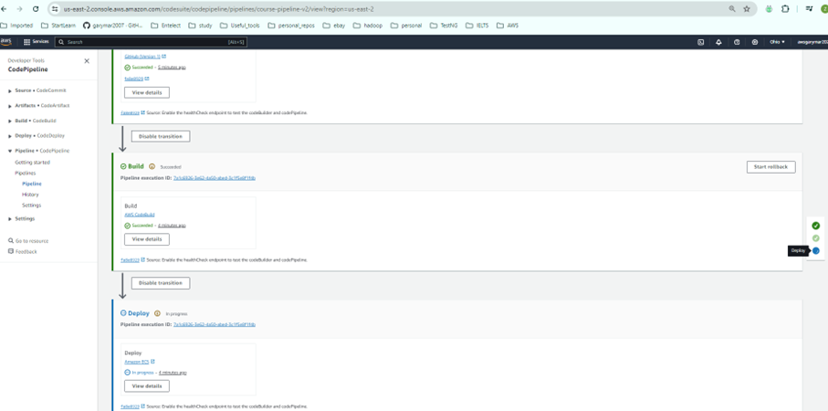
•	Check the swagger to see whether the healthCheck endpoint is there:
http://18.117.74.64:8080/swagger-ui/index.html
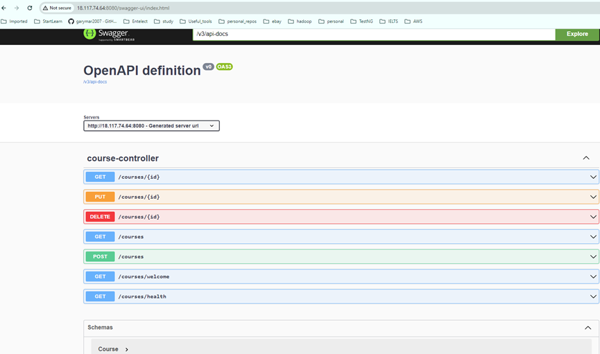


